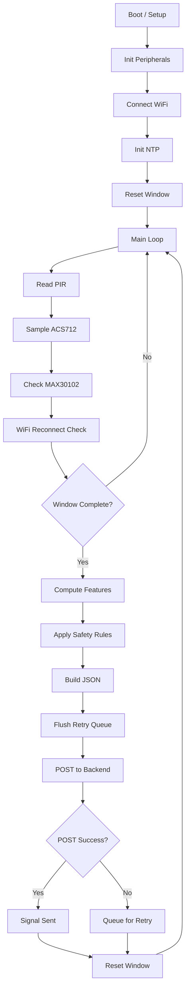

# Phase 1 Flowchart

```mermaid
flowchart TD
  A[Boot / Setup] --> B[Init Peripherals]
  B --> C[Connect WiFi]
  C --> D[Init NTP]
  D --> E[Reset Window]
  E --> F[Main Loop]

  F --> G[Read PIR]
  G --> H[Sample ACS712]
  H --> I[Check MAX30102]
  I --> J[WiFi Reconnect Check]
  J --> K{Window Complete?}

  K -- No --> F
  K -- Yes --> L[Compute Features]
  L --> M[Apply Safety Rules]
  M --> N[Build JSON]
  N --> O[Flush Retry Queue]
  O --> P[POST to Backend]
  P --> Q{POST Success?}
  Q -- Yes --> R[Signal Sent]
  Q -- No --> S[Queue for Retry]
  R --> T[Reset Window]
  S --> T
  T --> F
```
